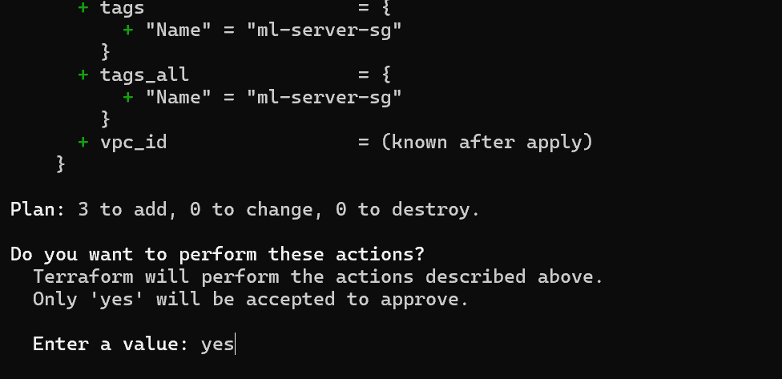
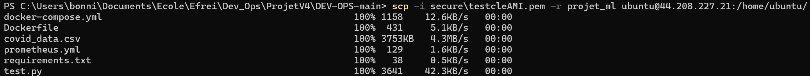
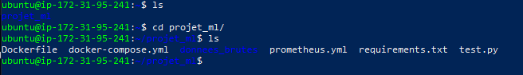
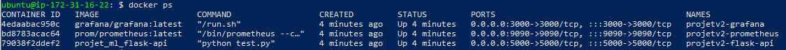
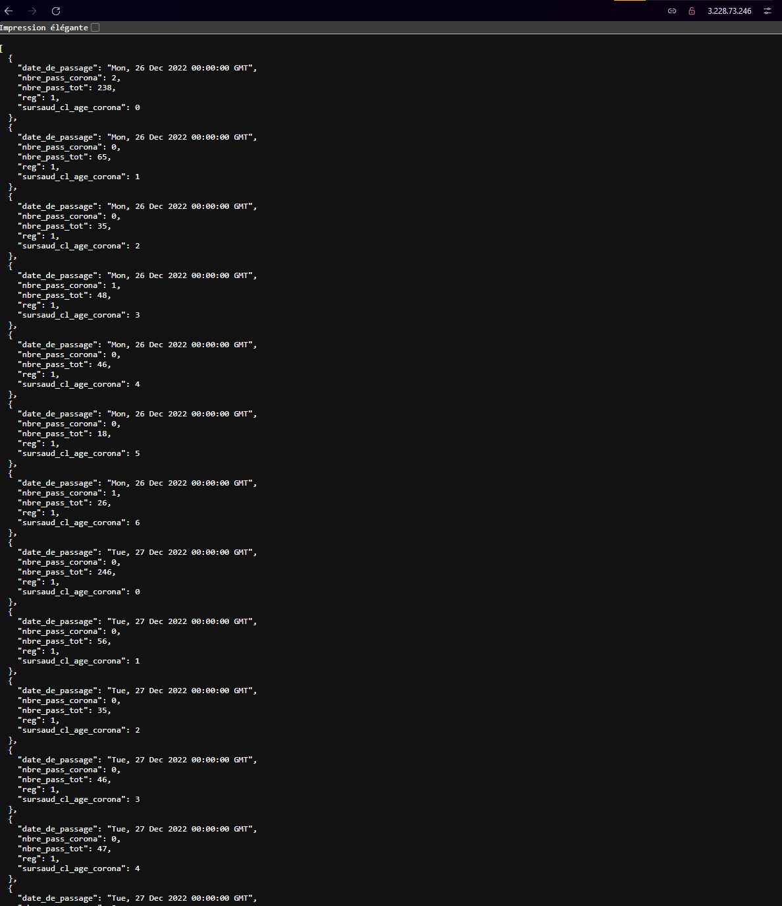
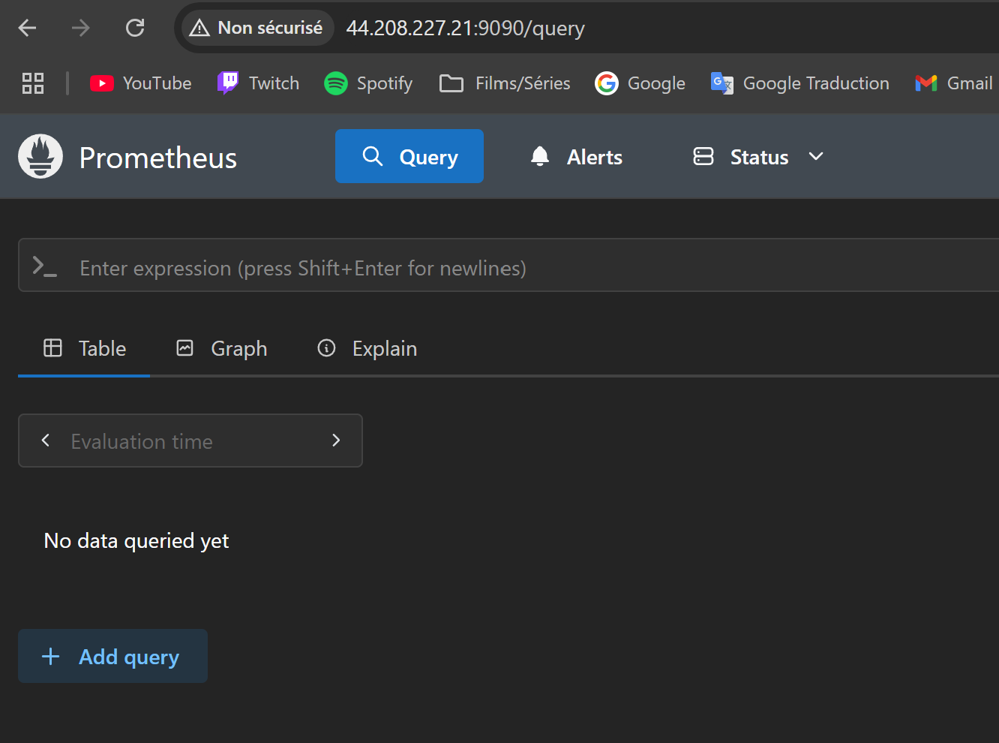
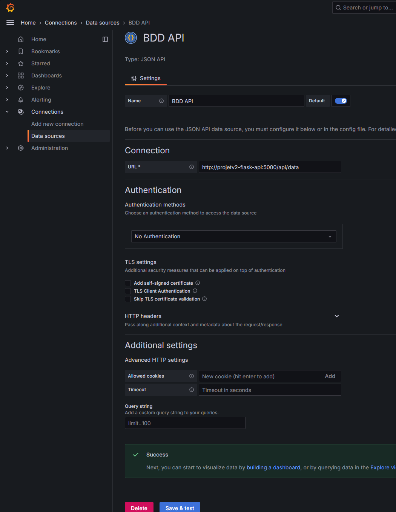
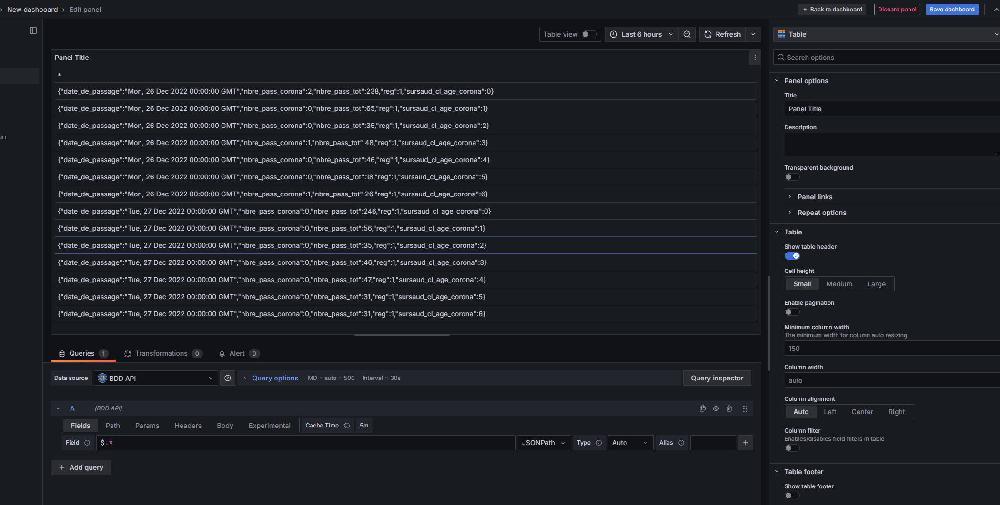
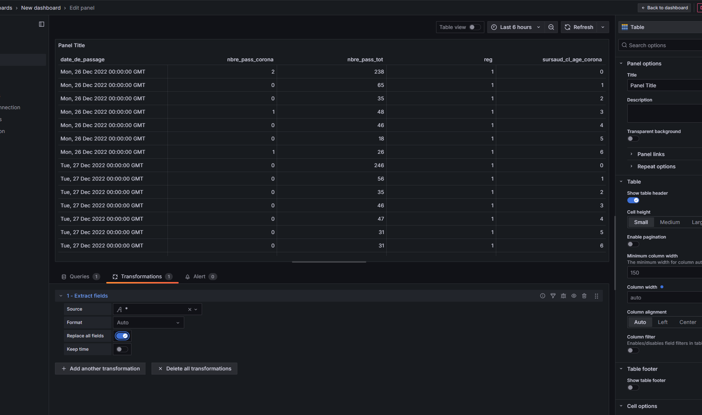

# Projet de DEV_OPS
### Ce projet a été réalisé par :
Victor BONNIN  
Joris CASADAVANT  
Manon WAREMBOURG

<br>

### -Pré-requis
Pour démarrer le projet, il faut avoir les fichiers suivants : 

- mlops-infra 
    - main.tf  
    - outputs.tf  
    - providers.tf  
    - variables.tf  

- projet_ml
    - donnees_brutes -  
        - covid_data.csv  
    - Dockerfile  
    - docker-compose.yml  
    - requirements.txt  
    - test.py

- secure
    - un_fichier_qui_contient_votre_clé_AMI.pem  

- README.md  
- terraform.exe  
- AWSCLIV2.msi  


Il faut bien veiller à ce que terraform fonctionne bien.
Penser à ajouter le chemin de 'terraform.exe' à 'PATH' dans les variables d'environnement (système).

Ensuite, il faut se rendre dans un invit de commande dans le dossier 'mlops-infra'.

Les instances qui sont dans le 'main.tf' nous appartiennent, donc au besoin, n'hésitez pas à les changer.
Les lignes de code à changer sont :
- ami = "ami-0e2c8caa4b6378d8c" --> ceci correspond au nom de l'instance dans AWS  
- Name = "ML-Server" --> ceci correspond au nom attribué à l'instance dans AWS

<br>

### - Créer son environement AWS

Aussi, pour lancer correctement les instances, vous aurez besoin de télécharger une extention AWS.

Il faudra donc avoir un compte AWS fonctionnel.
Exécuter donc le fichier AWSCLIV2.msi, et faites l'installation.

Pendant ce temps, il vous faudra générer une clé d'accès. Pour se faire, il faut vous connecter a votre compte en ligne AWS, cliquer en haut à droite de votre écran sur votre profil et aller dans "Informations d'identification de sécurité".  
Ensuite, vous arriverez sur une page et il faudra descendre un peu pour créer une nouvelle clé d'accès.  
Un fois que vous avez cliqué dessus, il faudra accepter que ce n'est pas une bonne pratique, et finalement créer la clé.  
Ensuite il faut bien penser a télécharger le fichier CSV, qui contiendra vos clés.

Maintenant, il faut configurer AWS avec votre compte.
Pour se faire, vous devez ouvrir un invit de commande et exécuter la commande :
```aws configure```

Cette dernière va vous demander différentes informations :  
AWS Access Key ID : (clé du fichier CSV)  
AWS Secret Access Key ID : (clé du fichier CSV)  
Default region name : us-east-1  
Default output format : json

Votre compte AWS devrait maintenant être lié avec votre pc.

Vous devrez ensuite aller dans AWS en ligne, aller dans "Réseau et sécurité" --> "Paires de clés", et créer une nouvelle clé. Une fois la clé créée, il faudra la télécharger et la glisser dans le projet, dans le dossier "secure". Le fichier que vous aurez sera alors : <nom_AMI.pem>.  
Ici, nous avons appelé la clé "testcleAMI".

Vous aurez donc normalement :
- secure
    - <nom_AMI.pem>.pem

Maintenant que vous disposez de cette clé, si jamais vous l'avez nommé différement de la mienne, il vous faudra remplacer le nom de la notre par le votre dans le fichier main.tf, autour de la ligne 60.

Maintenant que AWS est OK, on peut lancer notre instance.

Il faut donc executer les commandes suivantes :
Ces commandes sont à lancer dans le dossier "mlops_infra", là où sont situé les fichiers terraform.  
```terraform init```  
```terraform plan```  
```terraform apply```  

Si jamais vous avez déjà lancé une application, il vous fadura la détruire pour être sûr que tout fonctionne normalement :  
```terraform destroy```

Il faudra, pendant l'execution, accepter de créer l'instance en écrivant "yes" quand cela est demandé dans le terminal.



<br>

### - Démarrer l'instance

Vous pouvez dès maintenant aller récupérer l'IP de l'instance en allant sur AWS --> EC2 --> Instances (en cours d'exécution) --> IP élastique.

Maintenant, pour lancer l'instance, il faut lancer cette commande : 
```ssh -i <chemin_de_la_cle_AMI> ubuntu@<ip_de_l_instance_>```

Lorsque cette commande sera exectuée, vous devriez être connecté à votre instance, dans un environement Ubuntu.

Une fois dans notre environement ubuntu, nous devons télécharger docker pour que ce dernier puisse supporter notre application de machine learning. 
Pour se faire, toujours dans notre ubuntu, il faut exectuer les commandes suivantes :  

```sudo apt update```  
```sudo apt install -y docker.io```  
```sudo apt install docker-compose```  
```sudo usermod -aG docker $USER```  
```sudo systemctl start docker```  
```sudo systemctl enable docker```  
```docker --version```  
Ces commandes vont nous permettre d'installer docker sur notre instance EC2.

Une fois que tout cela fonctionne, il faut créer une application sur l'instance.

Pour faire cela, nous avons déjà préparé les fichiers qui vont nous permettre de lancer une application de machine learning.

Nous devons donc quitter notre instance en executant la commande ```exit```.

Une fois en dehors de l'instance, il faudra veiller a bien avoir le dossier suivant :

- projet_ml
    - donnees_brutes -  
        - covid_data.csv  
    - Dockerfile  
    - docker-compose.yml  
    - requirements.txt  
    - test.py

Si vous possédez bien ce dossier, il faudra ensuite exectuer la commande suivante :

```scp -i <chemin_de_la_cle_AMI> -r projet_ml ubuntu@<ip_de_l_instance_>:/home/ubuntu/```  
Cette commande va permettre de copier le dossier directement dans l'instance.



Ensuite, on peut à nouveau rentrer dans notre instance pour vérifier que le dossier et ce qu'il contient à bien été copié dedans avec la commande :
```ssh -i <chemin_de_la_cle_AMI> ubuntu@<ip_de_l_instance_>```

Vous devriez donc avoir ce rendu dans l'instance :


Une fois dans notre instance, on va pouvoir démarrer notre projet de machine learning, en se rendant bien dans le dossier qui contient le docker-compose :  
```cd projet-ml```  
```docker-compose up --build```

Si vous avez déjà lancé un docker-compose dans l'instance, n'oubliez pas de redémarrer les docker-compose et faisant les requêtes suivantes :  
```docker-compose down```  
```docker-compose build```

Maintenant, le serveur flask, l'API ainsi que tous les autres outils devraient fonctionner. Pour tester cela, on peut ouvrir un autre invit de commande pour aller voir.

Un fois rendu dans notre instance sur un autre CMD, on peut simplement executer la requête suivante pour être sur que tous nos containers fonctionnent correctement :
```docker ps```

Vous devriez avoir ce rendu :


Si vous avez cela, votre application fonctionne correcterment.

Vous pouvez donc faire la requêtes suivante, pour récupérer toutes les données du fichier CSV :
```curl http://localhost:5000/api/data```

Beaucoup de lignes devraient apparaitre. C'est normal, il y a beaucoup de données.

Maintenant, pour tester que les connections se font bien, on peut aller voir sur notre PC si on retrouver bien les mêmes résultats :
```http://IP_de_votre_instance:5000/api/data```

Vous devriez avoir un résultat de ce type :


On peut aussi aller voir si prometheus s'est bien lancé :
```http://IP_de_votre_instance:9090```


Et enfin, on va aussi pouvoir aller sur grafana, pour visualiser nos données :
```http://IP_de_votre_instance:3000```

Une fois sur grafana, vous allez devoir rentrer un login et un mot de passe :  
login : admin  
mdp : admin

Grafana vous demandera ensuite de définir un nouveau mot de passe, mais nous pouvons passer cette étape en cliquant sur 'skip'.

Une fois dedans, il va falloir connecter notre API à Grafana. Pour se faire, il faut aller dans "Connections" --> "Add new connection", et installer JSON API.  
Ensuite, il faut aller dans "Data Source", juste en dessous, et en ajouter une nouvelle et selectionne JSON API.  
Vous pouvez renommer comme vous le souhaitez votre source de données, mais le plus important est de bien rentre l'URL de connection :
```http://projetv2-flask-api:5000/api/data```

Ensuite, sauvegardez, et votre connection est prête :


Pour visualiser les données, on peut maintenant aller dans "Dashboards", et créer une nouvelle visualisation. Selectionnez votre source de donnée, et en haut à droite, selectionnez comme visuel un tableau. Ensuite, en bas, pour importer les données, vous pouvez faire : ```$.*```. Ainsi, vous allez pouvoir récupérer toutes les données de l'API.


Cependant, l'affichage n'étant pas très joli, nous pouvons l'améliorer en allant dans "Transformations", "Add transformation" et en selectionnant "Extract field".  Selectionnez la requête prtincipale, et nous avons un tableau plus joli :
 


### - Axes d'amélioration
Pour notre projet, nous avons détecté quelques axes d'améliorations que nous pourrons réaliser par la suite :
- Automatiser la récupération de l'adresse IP élastique pour encore plus automatiser le projet.
- Automatiser le lancement des requêtes lors de l'arrivée dans l'instance.

#### NE PAS OUBLIER D'ETEINDRE VOS INSTANCES/IP ELASTIQUES A LA FIN
#### OU LANCEZ UN TERRAFORM DESTROY POUR PLUS DE SIMPLICITE